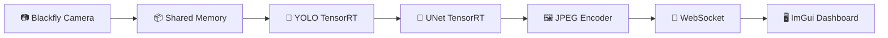

<div align="center">

# 🔬 Particle Vision

### Real-Time Particle Detection & Segmentation System

Industrial Camera · TensorRT · CUDA · WebSocket · ImGui


<br>

**Industrial Camera → Shared Memory → TensorRT Inference → Real-Time Dashboard**

</div>

---

## ✨ Highlights

|  🚀 Performance  |      ⚡ Pipeline     |    🎯 AI Inference   |
| :--------------: | :-----------------: | :------------------: |
|   TensorRT FP16  |    Shared Memory    |    YOLO Detection    |
| Dual CUDA Stream |      Zero Copy      |   UNet Segmentation  |
|   Dynamic Batch  | WebSocket Streaming | Real-Time Processing |

| 📡 Visualization | 🔧 Industrial Integration | 🖥 User Interface |
| :--------------: | :-----------------------: | :---------------: |
|  ImGui Dashboard |      Blackfly Camera      |  OpenGL Rendering |
|   ImPlot Charts  |       Spinnaker SDK       |  Live Monitoring  |

---

## 🏗 Architecture



---

## 🛠 Dependencies

### 📷 jetson_capture

* Spinnaker SDK
* OpenCV 4.x

### 🧠 jetson_infer

* CUDA 11.x
* TensorRT 8.x
* OpenCV 4.x

### 🖥 pc_viewer

* GLFW 3.x
* OpenGL3
* OpenCV 4.x
* ImGui
* ImPlot

---

## 🚀 Build

### Camera Capture

```bash
cd jetson_capture

cmake -B build
cmake --build build

sudo ./build/bin/SpinnakerAcquisition
```

### Inference Server

```bash
cd jetson_infer

cmake -B build
cmake --build build

./build/particle_demo
```

### PC Viewer

```bash
cd pc_viewer

cmake -B build
cmake --build build

./build/viewer <jetson-ip>
```

---

## 🧠 TensorRT Engine Generation

### YOLO

```bash
trtexec \
--onnx=yolo.onnx \
--saveEngine=jetson_infer/model/yolo_fp16.engine \
--fp16
```

### UNet

```bash
trtexec \
--onnx=unet.onnx \
--saveEngine=jetson_infer/model/unet.engine \
--fp16 \
--minShapes=input:1x1x128x128 \
--optShapes=input:4x1x128x128 \
--maxShapes=input:8x1x128x128
```

.engine 文件已经上传见组内资源导航,文件放在jetson_infer/model/

---

<div align="center">

###  ❤️ 

TensorRT · CUDA · OpenCV · WebSocket · ImGui

</div>
